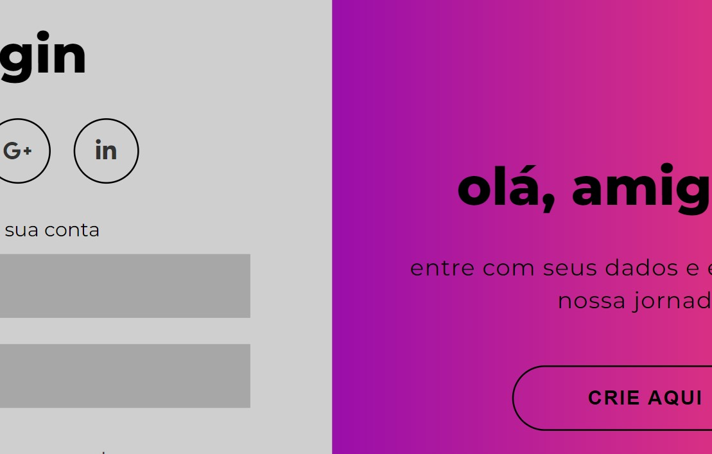

<h1 align="center"> Login Screen </h1>

Essa aplicação é uma simples e moderna tela de login e criação de conta para WEB.  

  <a href="#-tecnologias">Tecnologias</a>&nbsp;&nbsp;&nbsp;|&nbsp;&nbsp;&nbsp;
  <a href="#-projeto">Projeto</a>&nbsp;&nbsp;&nbsp;|&nbsp;&nbsp;&nbsp;
  <a href="#memo-licença">Licença</a>

  

 

  

## 🚀 Tecnologias

Esse projeto foi desenvolvido com as seguintes tecnologias:

- HTML e CSS
- JavaScript
- Git e Github

## 💻 Projeto

O Habits é um app para ajudar a rastrear os hábitos.

 - [Viste meu projeto](https://honnigam.github.io/screen-login)

## :memo: Licença

Esse projeto está sob a licença MIT.

---

Feito com ♥ by honnigam :wave: 